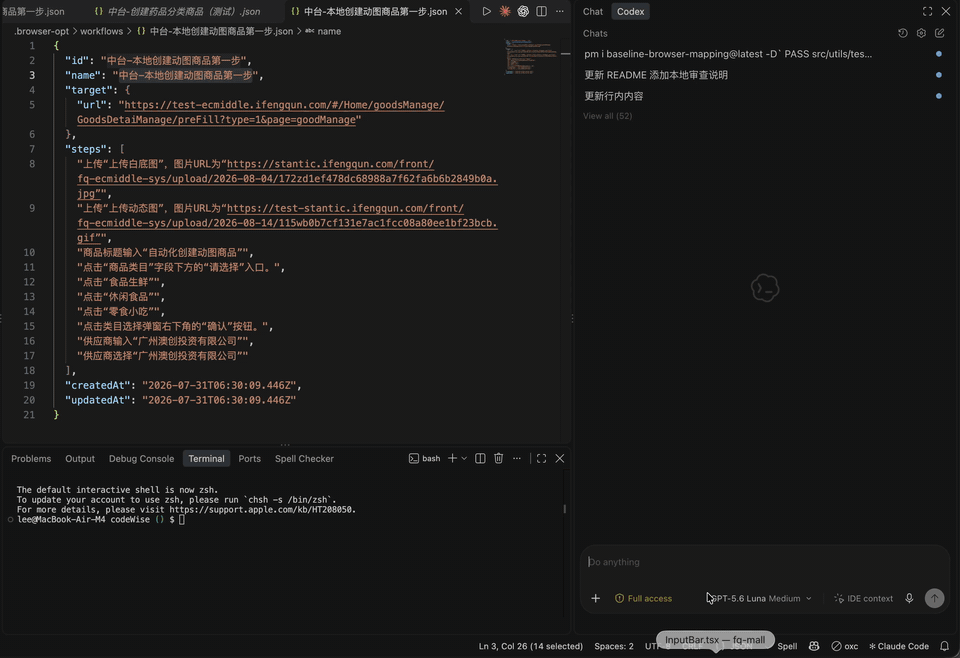
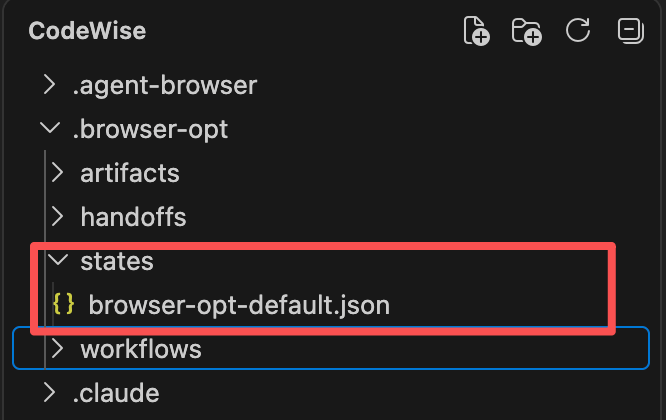
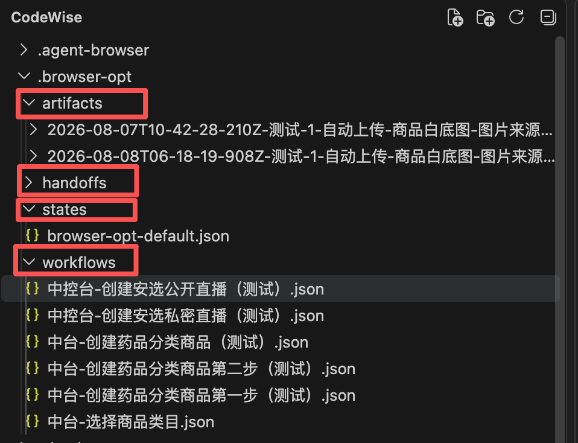
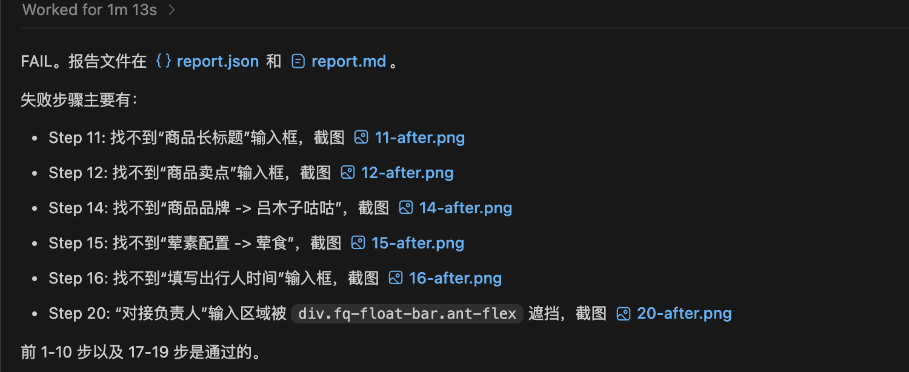
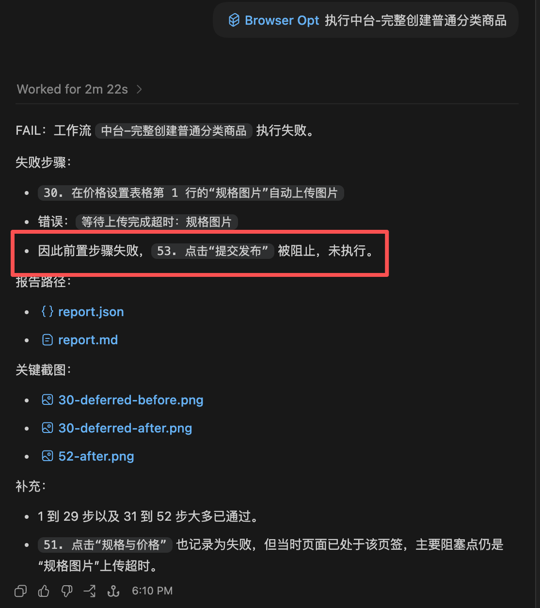

# browser-automated

> [!IMPORTANT]
> 当前只有 `browser-opt` 可用。`browser-e2e` **尚未实现**，仓库中的相关目录仅用于后续开发，请勿安装、调用或用于生产流程。

`browser-automated` 当前主要维护 `browser-opt`：一个面向真实 Chrome 的自然语言浏览器操作工具。它可以立即执行一次操作，也可以保存和复用项目级 Workflow，并为每次运行产出截图、页面快照、日志和 PASS/FAIL 报告。

`packages/browser-core/src` 存放共享的底层浏览器能力，但它不是独立发布的 npm package。`browser-e2e` 计划在未来复用这些能力，将自然语言需求沉淀为可重复执行的 Playwright 测试。

## 工具状态

| 工具 | 当前状态 | 是否可调用 | 定位 |
| --- | --- | --- | --- |
| `browser-opt` | ✅ 可用 | 是 | 执行自然语言浏览器流程，保存 Workflow 和运行证据 |
| `browser-core` | 🔒 内部模块 | 否 | 为上层工具提供浏览器连接、session 和 handoff 能力，不独立发布 |
| `browser-e2e` | 🚧 规划中 | 否 | 未来用于匹配、执行和生成 Playwright 测试 |

当前需要浏览器自动操作、页面调试或运行证据时，请使用 `browser-opt`。如果目标是生成可进入 CI 的 Playwright 测试，请等待 `browser-e2e` 后续实现。

## browser-opt 特性

| 特性 | 状态 | 说明 |
| --- | --- | --- |
| 自然语言即时执行 | ✅ 可用 | 用一段自然语言描述目标和步骤，立即在真实 Chrome 中执行 |
| Workflow 保存与复用 | ✅ 可用 | 将常用流程保存到项目中，后续用名称或短指令匹配并执行 |
| 登录态复用 | ✅ 可用 | 优先加载 State，失效后可回退到 Chrome Profile |
| 人工接管与恢复 | ✅ 可用 | 登录、验证码或本地文件选择等步骤可 handoff，完成后继续原运行 |
| 运行证据 | ✅ 可用 | 生成 PASS/FAIL 报告、日志、截图和页面结构快照 |
| 失败保护 | ✅ 可用 | 普通失败集中汇总；高影响操作在前置状态不确定时停止或跳过 |
| Playwright 测试生成 | 🚧 不可用 | 属于未来的 `browser-e2e` 能力，不由 `browser-opt` 提供 |

## 调用方式速查

根据使用场景选择入口：

| 场景 | 调用方式 | 是否立即打开浏览器 |
| --- | --- | --- |
| 在 AI 助手中执行一次流程 | `/browser-opt <自然语言流程>` | 是 |
| 在终端执行一次流程 | `browser-opt "<自然语言流程>"` | 是 |
| 保存 Workflow | `browser-opt save "<名称>" --flow "<完整流程>"` | 否 |
| 执行已保存的 Workflow | `browser-opt run "<名称或短指令>"` | 是 |
| 查看已保存的 Workflow | `browser-opt list` | 否 |
| 检查当前版本 | `browser-opt --version` | 否 |
| 检查是否有新版本 | `browser-opt check-update --no-cache --json` | 否 |
| 更新工具及 Skill | `browser-opt update` | 否 |

最短的一次性调用示例：

```text
/browser-opt 测试 https://example.com。

目标：
1. 验证页面包含“Example Domain”。
2. 点击“More information”链接。
3. 验证跳转后的页面可以正常访问。
```

同一流程也可以直接通过 CLI 执行：

```bash
browser-opt "测试 https://example.com。验证页面包含 Example Domain。"
```

> [!TIP]
> 一次性任务使用即时执行；需要反复运行的流程保存为 Workflow；可能遇到登录、验证码或本地文件选择的流程，使用后台运行与 handoff，详见[人工接管与恢复](#人工接管与恢复)。

## 效果展示

下面展示了在 IDE 中通过 `browser-opt` 一键发起浏览器操作的完整过程：



## 安装与环境初始化

需要 Node.js 24 或更高版本，并确保系统已安装 Chrome。

### 临时试用

只想试用、不安装 CLI 和 Skill，可直接运行：

```bash
npx -y --registry=https://registry.npmjs.org/ -p browser-opt@latest -p agent-browser@latest browser-opt "
执行创建药品分类商品流程
目标：
1. 打开页面https://test-ecmiddle.ifengqun.com/#/Home/goodsManage/GoodsDetaiManage/preFill?type=1&page=goodManage
2. 商品标题输入“自动化创建药品分类商品”
"
```

### 安装

首次安装执行：

```bash
npx browser-opt@latest install --registry=https://registry.npmjs.org/
```

该命令会一次性安装或更新全局 `browser-opt`、`agent-browser` 及 `browser-opt` Skill。默认 Skill 目录为 `~/.agents/skills/browser-opt`，Codex、GitHub Copilot、Gemini CLI 和 Qoder 可共用，无需分别安装。Claude Code 使用自己的目录：

```bash
npx browser-opt@latest install --registry=https://registry.npmjs.org/ --agent claude
```

### 更新

后续更新所有已安装组件：

```bash
browser-opt update
```

如果安装时用了 `--agent claude`，更新时也传入同一参数。

```bash
browser-opt update --agent claude
```

`browser-opt update` 会优先更新当前正在执行这条命令的那份安装前缀，避免机器上存在多个全局前缀时把包装到别处。只有当当前 shell 仍解析到旧二进制、`update` 不可用，或你明确要绕过现有全局命令时，才回退到下面这条安装命令：

```bash
npx browser-opt@latest install --registry=https://registry.npmjs.org/
```

### 卸载

卸载首次安装写入的全局 CLI、运行时和 Skill：

```bash
browser-opt uninstall
```

如果安装时用了 `--agent claude`，卸载时也传入同一参数。

```bash
browser-opt uninstall --agent claude
```

只有确认要删除当前项目的 `.browser-opt` 登录态、报告和 handoff 记录时，卸载才追加 `--all-data`。

```bash
browser-opt uninstall --all-data
```

### 环境说明

`install`、`update` 和试用命令默认使用系统标准 Chrome，不会下载 Chrome for Testing。机器没有标准 Chrome 且接受测试浏览器时，安装或更新可追加 `--download-browser`；试用前则需自行准备 Chrome。若执行 `install` 或 `update` 后 shell 仍指向旧的 `browser-opt`，请按命令输出提示调整 PATH 或重开终端。

Linux 无桌面或缺少浏览器系统库，并明确使用下载浏览器时：

```bash
npx browser-opt@latest install --registry=https://registry.npmjs.org/ --download-browser --with-deps
```

`install`（`setup` 保留为兼容别名）还支持 `--skills-dir <目录>` 自定义 Skill 根目录、`--skip-skill` 只处理运行时，以及 `--skip-runtime` 只安装 Skill。Skill 每次执行前会用 `browser-opt check-update --json` 轻量检查新版本。

## 使用

### 一次性执行

```bash
browser-opt "测试 https://example.com 的搜索功能。

目标：
1. 打开首页。
2. 验证页面包含 \"Example\"。"
```

### 保存并复用 Workflow

```bash
browser-opt save "示例首页验证流程" --flow "测试 https://example.com。\n1. 验证页面包含 \"Example\"。"
browser-opt run "执行示例首页验证流程"
```

也可以完全通过 Skill 保存和执行。保存请求只会写入 Workflow，不会打开浏览器或立即执行：

```text
/browser-opt 把下面的流程保存为“示例首页验证流程”，先不要执行。

目标页面：https://example.com

目标：
1. 验证页面包含“Example Domain”。
2. 点击“More information”链接。
3. 验证跳转后的页面可以正常访问。
```

保存成功后，用一句话执行：

```text
/browser-opt 执行示例首页验证流程
```

Workflow 默认保存到调用项目的 `.browser-opt/workflows/`；运行证据默认保存到 `.browser-opt/artifacts/`。

### Workflow 查询与匹配

列出当前项目保存的 Workflow：

```bash
browser-opt list
```

只匹配 Workflow、不启动浏览器：

```bash
browser-opt match "执行示例首页验证流程" --json
```

匹配结果唯一时可以直接用 `run` 执行；存在多个相似结果时，应先确认目标 Workflow，避免误跑流程。

### 人工接管与恢复

可能遇到登录、验证码或本地文件选择的流程，可以在后台启动并保留稳定的 `runId`：

```bash
browser-opt start --flow "<完整自然语言流程>" --json
browser-opt status --run-id "<runId>" --json
```

`status` 返回 `HANDOFF` 后，由操作者在真实 Chrome 中完成提示的操作，再恢复原运行：

```bash
browser-opt resume --run-id "<runId>" --json
browser-opt status --run-id "<runId>" --json
```

后台运行状态含义如下：

| 状态 | 含义 | 后续操作 |
| --- | --- | --- |
| `RUNNING` | 流程仍在自动执行 | 继续查询 `status` |
| `HANDOFF` | 正在等待人工操作 | 完成提示的操作后调用 `resume` |
| `PASS` | 流程执行成功 | 查看报告与证据 |
| `FAIL` | 流程执行失败 | 根据报告、日志和截图排查 |

如果需要主动终止仍在运行的后台任务：

```bash
browser-opt stop --run-id "<runId>" --json
```

## 登录态复用

执行需要鉴权的流程时，`browser-opt` 会优先复用已经保存的登录凭证，通常不需要重复登录。只有凭证确实失效且 Chrome Profile 也无法直接恢复时，流程才会进入 handoff，等待操作者在真实 Chrome 中完成登录；恢复后，工具会保存新的登录态并继续原流程。

### 核心思路

系统把登录凭证保存为轻量的 State 文件，其中只包含 cookies 和 Web Storage，不包含历史标签页。State 默认保存在项目的 `.browser-opt/states/` 目录中。每次执行先尝试加载 State；State 不存在时从 Chrome Profile 初始化；默认 State 失效时则回退一次 Chrome Profile，必要时再进入人工接管。



### 三条复用路径

**路径 A：已有 State 文件（最快）**

先打开空白页并加载 cookies 和 storage，再打开目标页。登录态会在目标页首批请求发出前完成恢复，避免页面先以未登录状态加载。

**路径 B：没有 State 文件（首次运行）**

使用 Chrome Profile 直接打开目标页。页面确认不在登录页且已正常渲染后，立即将当前 cookies 和 storage 保存为 State，后续运行自动转为路径 A。

**路径 C：默认 State 已失效（回退）**

关闭当前 State 窗口并切换到指定的 Chrome Profile，然后重新打开目标页。若仍停留在登录页，工具会尝试聚焦账号或密码输入框，以便 Chrome 展示已保存的凭证；仍无法恢复时进入 handoff。操作者完成登录并恢复流程后，工具会等待页面离开登录页，再保存新的 State 并继续执行。每轮运行最多回退一次，不会在 State 和 Profile 之间反复切换。

> [!NOTE]
> 自动 Profile 回退只适用于默认 State。显式传入 `--state <path>` 时，工具会严格使用该文件，不会自动切换 Profile。可用 `--profile <name>` 选择首次初始化和默认回退所使用的 Chrome Profile。

每次调用仍会使用全新的 browser session，避免继承旧标签页、表单内容或 Chrome 恢复页面；复用的是登录凭证，而不是上一次的浏览器窗口。

## 文件产物

所有默认路径均相对于执行命令时的当前项目目录：

```text
.browser-opt/
  workflows/
    <workflow-id>.json
  states/
    browser-opt-<profile>.json
    browser-opt-sessions.json
  handoffs/
    <run-id>/
      run.json
      output.log
      resume.signal
  artifacts/
    <本次运行目录>/
      report.json
      report.md
      run.log
      *.png
      *.snapshot.json
```

| 内容 | 默认路径 | 是否重要 | 作用与处理建议 |
| --- | --- | --- | --- |
| Workflow 文件 | `.browser-opt/workflows/<流程名称>.json` | 重要 | 保存可复用工作流；可提交到代码库或分享给其他人 |
| 登录状态 | `.browser-opt/states/` | 重要且敏感 | 保存 cookies、storage 和托管 session 记录；不要提交到代码库或分享 |
| 执行报告与截图 | `.browser-opt/artifacts/<本次运行目录>/` | 临时证据 | 用于复盘和排查；报告 Bug 时应发送对应运行目录的完整内容 |
| 人工接管记录 | `.browser-opt/handoffs/<run-id>/` | 临时状态 | 保存后台任务元数据、输出和恢复信号；任务结束且无需排查时可清理 |



每次运行的证据目录通常包含：

- `report.md`：便于人工阅读的执行报告
- `report.json`：供程序读取的结构化执行结果
- `run.log`：完整执行日志
- `*.png`：初始页面及各步骤执行前后的截图
- `*.snapshot.json`：各阶段的页面结构快照
- `uploads/`：存在远程文件上传步骤时下载的临时文件

普通步骤失败时，工具会在流程结束后汇总失败步骤、错误原因和对应截图；仍可安全执行的低风险步骤可以继续。报告和图片都保存在 `.browser-opt/artifacts/<本次运行目录>/`，便于回看页面状态和定位阻塞点。



对于导出、删除、提交、发布等高影响操作，只要前置步骤出现阻塞性失败，该操作就会被跳过；高影响步骤自身失败时也会立即停止后续操作，防止在页面状态不确定时继续产生副作用。



当运行证据超过 10 份，或 `artifacts` 与已结束的 `handoffs` 合计超过 500 MB 时，CLI 会给出按时间排序的清理建议，但不会自动删除文件。确认运行正常且不再需要排查后，可以手动清理对应的临时目录；不要删除仍需复用的 Workflow 和 State。

## browser-e2e 规划

`browser-e2e` 的目标是匹配已有 E2E 用例、执行测试，并生成 Playwright 测试代码。目前该能力**尚未实现**，README 暂不提供安装和使用命令；在正式实现并验证前，仓库内的占位代码和脚本不代表可用功能。

## 仓库结构

- `packages/browser-core/src`：底层浏览器适配、session、handoff 与基础类型；不独立发布
- `packages/browser-opt/src`：`browser-opt` 包源码与 CLI
- `packages/browser-opt/skills`：随 `browser-opt` 发布的 Skill
- `packages/browser-e2e`：尚未实现的规划目录，不提供可用 CLI
- `packages/*/dist`：构建产物，由构建命令生成

## 开发

```bash
npm ci
npm run typecheck
npm test
npm run build
npm pack --dry-run -w browser-opt
```

### 在其他项目调试本地 browser-opt

在本仓库根目录执行下面的命令，将当前 Node/NVM 环境中的全局 `browser-opt` 切换到本地源码构建：

```bash
npm run browser-opt:use-local
npm run browser-opt:status
```

之后切换到任意其他项目，继续直接调用 `browser-opt` 即可，不需要修改其他项目的依赖：

```bash
cd /path/to/another-project
browser-opt --version
browser-opt check-update --json
```

本地源码再次修改后，重新执行 `npm run browser-opt:use-local`，它会刷新 `dist` 并保持全局软链。调试完成后恢复 npm 最新版：

```bash
npm run browser-opt:use-npm
npm run browser-opt:status
```

`browser-opt:status` 会同时检查软链目标和执行权限；若显示“不可执行”，重新运行 `npm run browser-opt:use-local` 即可修复本地构建入口权限，不要用 `npx browser-opt@latest install` 覆盖本地调试链接。

需要恢复指定 npm 版本时，可把版本号透传给切换脚本：

```bash
npm run browser-opt:use-npm -- 1.0.21
```

只改共享底层代码并需要刷新 `browser-opt` 的本地构建产物时：

```bash
npm run build -w browser-opt
```

## 发版

```bash
npm run release:check
npm run release:dry-run
npm run release:dry-run minor
npm run release browser-opt minor
npm run release:browser-opt minor
```

`browser-opt` 的构建会把共享底层代码编译进自己的 `dist/browser-core`，不会单独发布 core 包。`browser-e2e` 尚未实现，不应执行相关发版命令。
