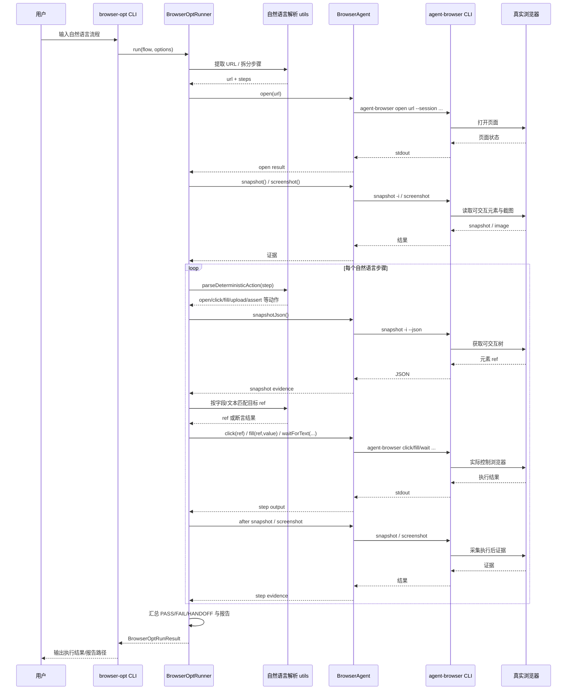

# 项目结构与能力边界

本文档面向临时接手项目的开发者，说明仓库为什么按当前方式划分，以及四类核心能力分别应该改哪些文件。

## 对外产物

项目最终只对外抛出两个 CLI / Skill 名称：

| 产物 | 定位 | 适用场景 | 不负责 |
| --- | --- | --- | --- |
| `browser-opt` | 浏览器控制 | 一次性任务、即时网页操作、证据报告 | 匹配历史测试、生成 Playwright 测试 |
| `browser-e2e` | E2E 测试执行和生成 | 复用已有测试、自然语言 E2E、生成测试代码 | 纯即时操作报告 |

底层可以共用 `BrowserAgent`、确定性执行、handoff、Playwright 生成器，但新增能力必须先判断属于哪个对外产物，避免重新扩散出第三个入口。

## 四类能力分区

### 1. 自然语言执行网页操作

入口：

- CLI：`browser-opt "<自然语言流程>"`
- Skill：`skills/browser-opt/SKILL.md`

代码：

- `src/browser-opt/runner/index.ts`：browser-opt 主编排，负责 URL / 步骤解析、整体执行循环、报告落盘。
- `src/browser-opt/runner/step-executor.ts`：单步骤生命周期，负责 before/after snapshot、动作重试、验证与步骤级 handoff 恢复。
- `src/browser-opt/runner/deterministic-actions.ts`：确定性动作执行层，负责字段匹配、长表单滚动搜索、switch DOM 兜底、下拉展开与上传素材准备。
- `src/browser-opt/runner/evidence.ts`：快照采集、初始页面稳定等待与 URL 归一化等证据工具。
- `src/browser-opt/runner/handoff.ts`：登录态识别、handoff 上下文、恢复后状态保存。
- `src/browser-opt/index.ts`：导出 browser-opt 的稳定模块 API。
- `src/browser-opt/utils.ts`：自然语言步骤切分、确定性动作解析、快照节点匹配与验证辅助。
- `src/browser-opt/type.ts`：browser-opt 执行、handoff、报告所需的本地类型定义。
- `src/cli/browser-opt.ts`：browser-opt 独立 bin 入口，只负责转发到 CLI 命令层。
- `src/cli/commands/browser-opt.ts`：browser-opt 命令参数解析与执行编排。
- `src/core/agent.ts`：封装 `agent-browser` 的 open、chat、snapshot、screenshot、scroll、eval、session 等能力。

产物：

- `.browser-opt/artifacts/<run-id>/report.json`
- `.browser-opt/artifacts/<run-id>/report.md`
- `*.snapshot.json`
- `*.png`
- `run.log`

修改原则：

- 主流程编排放在 `src/browser-opt/runner/index.ts`，步骤执行、证据采集、handoff 和确定性动作分别落在同级子文件，避免重新回到“大一统 runner”。
- 自然语言解析、节点匹配和步骤验证优先放在 `src/browser-opt/utils.ts`，不要把选择器启发式散落到多个执行文件。
- 不在 `browser-opt` 中做测试索引匹配或测试代码生成。

### 2. 沉淀可复用 Skill / Workflow

入口：

- Skill：`skills/browser-opt`、`skills/browser-e2e`
- 当前复用索引：`tests/generated/index.json`
- 规划中的 workflow 目录：`.browser-automated/workflows/`

代码：

- `src/browser-e2e/test-reuse/service.ts`：E2E 测试复用主编排，负责匹配、一次性执行、生成建议。
- `src/browser-e2e/test-reuse/matcher.ts`：根据自然语言、标签和 hints 匹配已有生成测试。
- `src/browser-e2e/test-reuse/index-store.ts`：读写生成测试索引。
- `src/browser-e2e/test-reuse/types.ts`：测试复用链路的输入输出类型。

产物：

- `skills/browser-opt/SKILL.md`
- `skills/browser-e2e/SKILL.md`
- `tests/generated/index.json`
- 后续 workflow schema 建议放入 `.browser-automated/workflows/*.json`

修改原则：

- Skill 文档只描述触发和编排，不复制底层实现。
- 可复用流程应先沉淀到索引或 workflow，再由 `browser-e2e` 匹配复用。

### 3. 生成 E2E 测试代码

入口：

- CLI：`browser-e2e gen <url> <instruction>`
- CLI：`browser-e2e run <url> <instruction> --auto-generate`
- Skill：`skills/browser-e2e/SKILL.md`

代码：

- `src/browser-e2e/generate.ts`：把 URL 和自然语言描述转为结构化 `TestCase`。
- `src/browser-e2e/test-reuse/playwright.ts`：生成 Playwright spec、执行 spec、构建测试元数据。
- `src/browser-e2e/test-reuse/index-store.ts`：生成后更新索引。
- `src/browser-e2e/test-reuse/service.ts`：把生成能力串入 E2E workflow。

产物：

- `tests/generated/*.spec.ts`
- `tests/generated/index.json`

修改原则：

- 生成代码必须保持 Playwright Test 标准格式。
- 生成后要同步更新索引，否则后续自然语言无法命中已有测试。
- 断言不能只验证“无报错”，应绑定 URL、文本、可见元素或业务状态。

### 4. Handoff 机制

入口：

- 当前内置在 `browser-e2e` 执行流程中。

代码：

- `src/cli/index.ts`：聚合 `browser-opt` / `browser-e2e` 两个独立 bin 的共享导出。
- `src/cli/commands/legacy.ts`：旧入口兼容、handoff 交互、等待用户输入 done、打印 live viewport 信息。
- `src/browser-e2e/deterministic.ts`：连续失败计数、handoff 生命周期回调、恢复后继续执行。
- `src/core/agent.ts`：challenge 探测、`handoff()`、`resume()`、同 session 可见浏览器。
- `src/browser-e2e/test-reuse/service.ts`：把 handoff 配置传入一次性执行流程。

触发场景：

- CAPTCHA / bot detection
- OAuth 授权或 consent
- MFA / 2FA
- 连续 3 次动作失败

修改原则：

- handoff 必须保留同一 session，避免用户完成后状态丢失。
- 恢复后不应重复已经成功的步骤。
- handoff 过程要进入执行结果和日志，方便失败复盘。

## 推荐阅读顺序

1. `README.md`：了解两个对外入口。
2. `docs/project-structure.md`：确认能力边界和文件归属。
3. `src/cli/index.ts`：理解 CLI 如何分发到两个产物。
4. `src/browser-opt/runner/index.ts`：理解一次性自然语言执行闭环。
5. `src/browser-e2e/test-reuse/service.ts`：理解 E2E 匹配、执行、生成闭环。
6. `src/browser-e2e/deterministic.ts`：理解确定性步骤和 handoff。
7. `src/browser-e2e/test-reuse/playwright.ts`：理解测试代码生成和执行。

## 当前目录职责

```text
src/
  cli/
    browser-opt.ts        browser-opt 独立 CLI 入口
    browser-e2e.ts        browser-e2e 独立 CLI 入口
    index.ts              CLI 聚合导出
    commands/
      browser-opt.ts      browser-opt 命令参数解析与执行编排
      browser-e2e.ts      browser-e2e 命令参数解析与执行编排
      legacy.ts           旧入口兼容与 handoff 交互
    utils/
      args.ts             共享参数解析辅助
      constants.ts        CLI 共享常量
      output.ts           CLI 输出与展示辅助
  core/
    agent.ts              agent-browser 命令封装、session、可见浏览器、handoff/resume
    types.ts              通用 TestCase、StepResult、AgentOptions 类型
    index.ts              core 稳定导出
  browser-opt/
    index.ts              browser-opt 稳定导出
    type.ts               browser-opt 本地类型定义
    utils.ts              步骤解析、节点匹配、验证辅助
    runner/
      index.ts            browser-opt 主执行编排与报告落盘
      step-executor.ts    单步骤快照、动作、验证与恢复闭环
      deterministic-actions.ts
                           确定性动作执行、长表单搜索、switch/select 兜底
      evidence.ts         snapshot 采集与页面稳定等待
      handoff.ts          登录态识别、handoff 上下文与恢复保存
  browser-e2e/
    deterministic.ts      自然语言步骤到确定性动作的解析、执行和 handoff
    generate.ts           自然语言描述到 TestCase 的生成
    runner.ts             结构化 JSON TestCase 的运行器
    index.ts              browser-e2e 稳定导出
    test-reuse/
      service.ts          browser-e2e 测试复用主编排
      matcher.ts          已生成测试匹配
      index-store.ts      tests/generated/index.json 读写
      playwright.ts       Playwright spec 生成与执行
      types.ts            Skill / generated test 类型

skills/
  browser-opt/            Codex/Agent 使用的一次性操作 Skill
  browser-e2e/            Codex/Agent 使用的 E2E Skill

docs/
  implementation-plan.md  阶段规划
  project-structure.md    当前结构和能力边界

tests/
  core/                   core 共享能力测试
  browser-opt/            browser-opt 执行闭环测试
  browser-e2e/            E2E 执行、生成与测试复用链路测试
  cli/                    CLI 用户侧行为测试
  generated/              自动生成的 Playwright 测试与索引
```

## 执行时序
**把自然语言先拆成 URL、步骤和结构化动作，再用页面 snapshot 匹配元素 ref，最后通过 BrowserAgent 调 agent-browser CLI 的 open/click/fill/wait/screenshot 等命令去驱动真实浏览器会话**



## 后续扩展落点

| 要做的事 | 建议落点 |
| --- | --- |
| browser-opt 报告字段扩展 | `src/browser-opt/runner/index.ts` |
| browser-opt 新的快照/验证策略 | `src/browser-opt/utils.ts` 或 `src/browser-opt/runner/evidence.ts` |
| browser-opt 新的确定性控件动作 | `src/browser-opt/runner/deterministic-actions.ts` |
| browser-e2e 新子命令 | `src/cli/commands/browser-e2e.ts`、必要时补 thin wrapper |
| 新的测试匹配策略 | `src/browser-e2e/test-reuse/matcher.ts` |
| workflow schema | `src/browser-e2e/workflows/*` 或 `src/browser-e2e/test-reuse/workflows/*` |
| workflow 文件 | `.browser-automated/workflows/*.json` |
| handoff 状态持久化 | `src/browser-e2e/deterministic.ts` 与 `src/core/agent.ts` |
| Playwright locator 生成优化 | `src/browser-e2e/test-reuse/playwright.ts` |
