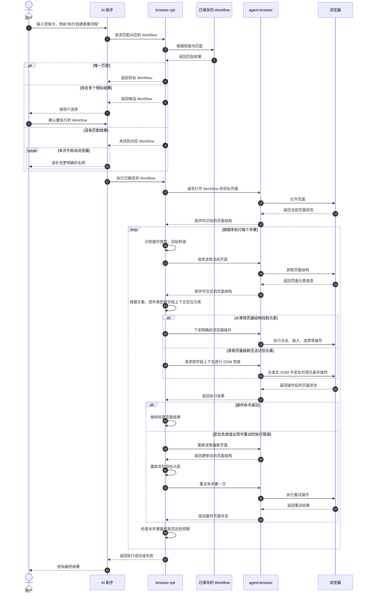

<!-- 本文件用跨角色易读的方式说明 browser-opt 执行已保存 Workflow 的核心时序。 -->

# browser-opt

`browser-opt` 用于根据一句自然语言短指令找到已保存的 Workflow，并按顺序完成其中的浏览器操作。

## Workflow 短指令执行时序

## 统一说明

1. **先匹配，再执行。** 短指令不会被当作新的临时流程，而是用来查找已经保存好的 Workflow。

2. **不确定时由用户决定。** 唯一匹配可以继续执行；存在多个相似结果时先请用户选择；没有匹配结果时不会启动浏览器。

3. **按步骤理解和操作页面。** browser-opt 会依次读取当前页面、理解步骤意图、执行操作，并检查页面是否达到预期。

4. **执行错误后只重试一次。** 某一步因元素定位失效或可恢复的执行错误而失败时，browser-opt 会重新读取页面并再尝试一次；动作已经执行但最终验证未通过时会直接返回失败，避免重复提交业务操作。

## browser-opt 与 agent-browser 如何协作

browser-opt 负责理解 Workflow 步骤、匹配页面元素并判断结果，agent-browser 负责读取真实页面和执行确定性浏览器操作；常规元素无法识别时，browser-opt 会借助 agent-browser 在字段上下文内查询 DOM 进行兜底。

例如，Workflow 步骤为“在‘直播间名称’输入‘周五新品发布’”时，协作过程如下：

1. browser-opt 从自然语言中识别出操作类型是“输入”、目标字段是“直播间名称”、输入值是“周五新品发布”。
2. browser-opt 请求 agent-browser 读取当前页面；agent-browser 返回可交互元素列表，并为当前页面中的元素提供 `e1`、`e2` 等临时引用，例如 `textbox "直播间名称" [ref=e1]`，执行命令时该引用写作 `@e1`。
3. browser-opt 先筛选输入框类型的元素，再用字段文案“直播间名称”匹配元素的名称、标签或占位提示，优先采用准确或包含关系匹配，再用保守的字符匹配兜底；匹配到 `ref=e1` 后，将其确定为本步骤的目标元素。这个 ref 来自 agent-browser 返回的当前页面结构，不是 browser-opt 猜测的 CSS 选择器。
4. browser-opt 把“向 `@e1` 填写‘周五新品发布’”这一明确操作交给 agent-browser，agent-browser 再在真实浏览器中执行输入。
5. 如果执行时发现 `@e1` 已失效，browser-opt 会重新读取页面并再次匹配；同一个输入框此时可能获得新的 ref，例如 `@e7`，随后使用新 ref 重试一次。
6. 输入成功后，browser-opt 再次读取页面，按“直播间名称”重新找到当前输入框并检查其值是否为“周五新品发布”；验证未通过时直接返回失败，避免重复填写。
7. 如果常规页面结构始终没有暴露该输入框，browser-opt 会让 agent-browser 在真实 DOM 中查找“直播间名称”所在表单区域内的可编辑元素；定位成功后执行输入，无法可靠定位则返回失败。

### 1. browser-opt 负责识别和决策

browser-opt 先把 Workflow 中的自然语言步骤整理成明确的“操作类型、操作目标和操作值”。例如：

- “在直播间名称输入‘自动化测试直播间’”会被理解为：向“直播间名称”输入指定内容。
- “点击‘下一步’”会被理解为：查找并点击文案为“下一步”的可点击元素。
- “验证页面包含‘创建成功’”会被理解为：操作完成后检查页面是否出现目标文案。

识别出操作后，browser-opt 再结合页面元素的文案、控件类型、可用状态以及所在字段，选择最符合目标的元素。存在多个相似元素时会优先使用字段上下文缩小范围，避免只按全页面文案随意选择。

### 2. agent-browser 负责读取和执行

agent-browser 是 browser-opt 与真实浏览器之间的执行层，主要承担两类工作：

- 读取当前页面，把可交互元素及其文案、控件类型和状态提供给 browser-opt。
- 接收 browser-opt 已经确定的操作，完成打开页面、点击、输入、选择或上传等浏览器动作。

两者的分工可以概括为：browser-opt 决定“要做什么、操作哪个元素、结果是否正确”，agent-browser 负责“读取真实页面并把确定的操作执行出来”。

### 3. DOM 元素识别兜底

部分业务页面使用自定义表单、伪按钮、隐藏上传控件等组件，这些元素可能不会完整出现在常规页面结构中。此时 browser-opt 会通过 agent-browser 查询真实 DOM，作为元素识别的补充手段。

DOM 兜底会先找到目标字段的标题或说明，再把搜索范围限制在同一表单区域及其邻近结构中。点击、输入和选择只使用可见、可用且符合目标文案或控件类型的元素；上传场景则可以在字段范围内找到组件隐藏的真实文件输入控件。定位成功后，仍由 agent-browser 执行具体操作；无法可靠定位时则返回失败，不会在整个页面中盲目点击或输入。

### 4. 失败后的协作重试

如果元素定位失效或出现可恢复的执行错误，browser-opt 会要求 agent-browser 重新读取最新页面，放弃旧的元素定位结果，再根据新页面重新识别目标并重试一次。重试仍失败时结束该步骤；如果动作已执行但页面验证未通过，则直接返回失败，避免重复操作。